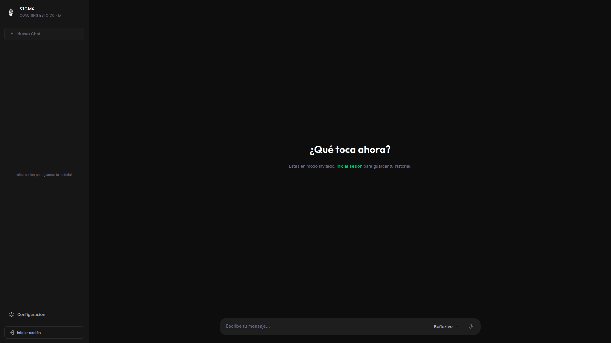
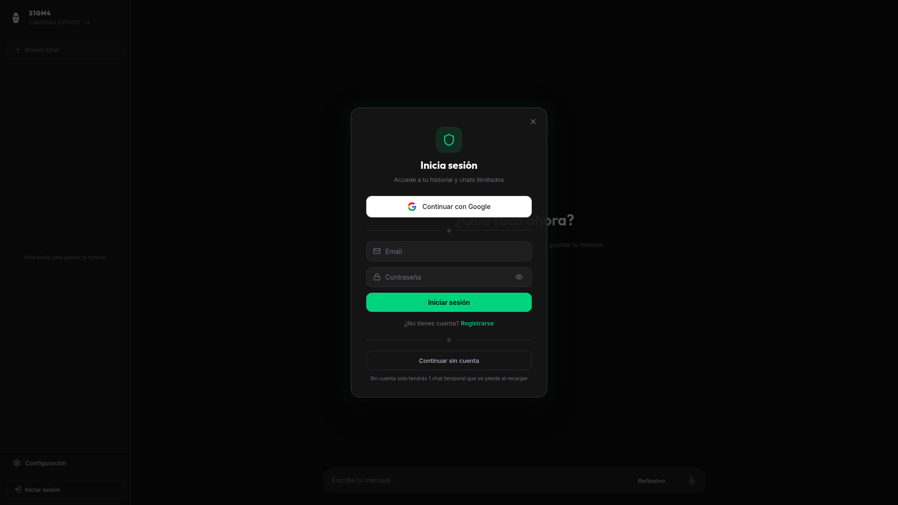
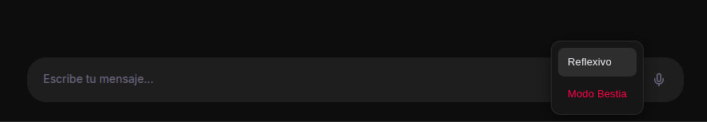
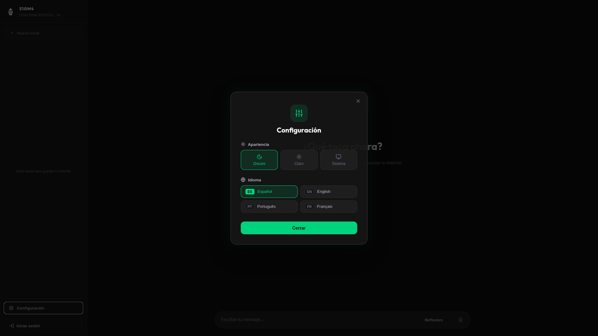

<div align="center">
  
  <h1>S1GM4</h1>
  <p><strong>Coaching estoico potenciado por inteligencia artificial.</strong></p>
  <p>Reflexiona con calma. Actúa con intención. Entrena tu mente.</p>

  <p>
    <a href="https://github.com/PabloAquiseLozano/s1gm4/stargazers"></a>
    <a href="https://github.com/PabloAquiseLozano/s1gm4/issues"></a>
    <a href="https://github.com/PabloAquiseLozano/s1gm4/blob/main/LICENSE"></a>
  </p>

  <p>
    
    
    
    
    
  </p>
</div>

---

## Sobre el proyecto

**S1GM4** es una aplicación web de coaching y reflexión personal impulsada por Google Gemini. Puedes conversar con dos personalidades diferentes según lo que necesites en cada momento:

| Modo | Personalidad | Ideal para |
| --- | --- | --- |
| **Reflexivo** | Sereno, empático y estructurado | Analizar situaciones, ordenar pensamientos y encontrar perspectiva |
| **Modo Bestia** | Directo, intenso y sin excusas | Romper la procrastinación y convertir intención en acción |

> S1GM4 no busca reemplazar a un profesional de la salud mental. Es una herramienta de reflexión, acompañamiento y motivación.

## Funcionalidades

- Respuestas del modelo en tiempo real mediante **Server-Sent Events (SSE)**.
- Conversaciones persistidas para usuarios autenticados.
- Inicio de sesión con Google OAuth o email y contraseña.
- Entrada de mensajes por voz con Web Speech API.
- Respuestas con Markdown: tablas, listas, citas y formato enriquecido.
- Modos Reflexivo y Modo Bestia con prompts independientes.
- Interfaz responsive para escritorio y dispositivos móviles.
- Tema claro, oscuro y automático según el sistema.
- Interfaz disponible en español, inglés, portugués y francés.
- Seguridad de chats y mensajes mediante Supabase RLS.

## Vista previa

### Pantalla principal

<p align="center">
  
</p>

### Inicio de sesión

<p align="center">
  
</p>

### Modos de personalidad

<p align="center">
  
</p>

### Configuración

<p align="center">
  
</p>

Las imágenes están almacenadas en [`docs/screenshots/`](docs/screenshots/). Para añadir nuevas capturas, guarda el archivo en esa carpeta y referencia la ruta desde Markdown.

## Arquitectura

```text
s1gm4/
├── frontend/                     React 19 + Vite 8
│   ├── src/
│   │   ├── components/           Interfaz de usuario
│   │   ├── contexts/             Auth y preferencias
│   │   ├── hooks/                Chat y reconocimiento de voz
│   │   ├── services/             API SSE y CRUD de Supabase
│   │   ├── config/               Modos de personalidad
│   │   └── supabaseClient.js     Cliente público de Supabase
│   └── vite.config.js
│
├── backend/                      FastAPI + Python
│   └── chatbot/
│       ├── main.py               Aplicación FastAPI
│       ├── routers/               Endpoints HTTP
│       ├── services/              Gemini, streaming y prompts
│       ├── prompts/               Personalidades del chatbot
│       └── models/                Schemas Pydantic
│
├── supabase/
│   └── migrations/               Tablas, relaciones y políticas RLS
│
├── docs/
│   └── screenshots/              Capturas de la aplicación
│
└── README.md
```

## Flujo de una conversación

```text
Usuario
  │
  ├── Escribe o dicta un mensaje
  ▼
Frontend React
  │
  ├── Guarda el mensaje en Supabase si inició sesión
  └── Solicita POST /api/chat/stream
  ▼
Backend FastAPI
  │
  ├── Selecciona el prompt del modo elegido
  ├── Envía el historial a Gemma 4
  └── Devuelve tokens mediante SSE
  ▼
Frontend
  │
  ├── Procesa el stream
  ├── Renderiza Markdown en tiempo real
  └── Guarda la respuesta final en Supabase
```

## Tecnologías

| Capa | Tecnología |
| --- | --- |
| Interfaz | React 19, Vite 8, Material UI, Emotion |
| Backend | FastAPI, Uvicorn, Pydantic |
| Inteligencia artificial | Google Gemini SDK, Gemma 4 26B |
| Autenticación | Supabase Auth, Google OAuth, email/password |
| Base de datos | PostgreSQL administrado por Supabase |
| Streaming | Server-Sent Events |
| Reconocimiento de voz | Web Speech API |
| Frontend en producción | Netlify |
| Backend en producción | Render |

## Instalación local

### Requisitos

- Node.js 18 o superior.
- npm o pnpm.
- Python 3.10 o superior.
- Una API key de [Google AI Studio](https://aistudio.google.com/app/apikey).
- Un proyecto de [Supabase](https://supabase.com).

### 1. Clonar el repositorio

```bash
git clone https://github.com/PabloAquiseLozano/s1gm4.git
cd s1gm4
```

### 2. Configurar Supabase

Ejecuta [`supabase/migrations/0001_init.sql`](supabase/migrations/0001_init.sql) desde **Supabase → SQL Editor**. La migración crea:

- `chats` y `messages`.
- La relación entre ambas tablas.
- Índices para las consultas principales.
- Políticas RLS para que cada usuario solo acceda a sus propios datos.

La migración está versionada en [`supabase/migrations/0001_init.sql`](supabase/migrations/0001_init.sql).

### 3. Configurar proveedores de autenticación

En Supabase, ve a **Authentication → Providers** y activa los métodos que quieras utilizar:

- **Email** para registro e inicio de sesión con correo y contraseña.
- **Google** para Google OAuth.

Para Google OAuth, configura en Google Cloud las credenciales OAuth y añade estas URLs autorizadas:

```text
http://localhost:5173
https://tu-dominio-de-netlify.netlify.app
```

En Supabase, configura la URL pública de la aplicación en **Authentication → URL Configuration**.

### 4. Configurar y ejecutar el backend

```bash
cd backend
python -m venv venv
source venv/bin/activate
pip install -r requirements.txt
```

En Windows:

```powershell
.\venv\Scripts\activate
```

Crea `backend/.env`:

```env
GEMINI_API_KEY=tu_api_key_de_google_ai
CHATBOT_MODEL=gemma-4-26b-a4b-it
```

Inicia FastAPI:

```bash
uvicorn chatbot.main:app --reload --port 8000
```

### 5. Configurar y ejecutar el frontend

En otra terminal:

```bash
cd frontend
npm install
```

Crea `frontend/.env`:

```env
VITE_SUPABASE_URL=https://tu-proyecto.supabase.co
VITE_SUPABASE_ANON_KEY=tu_clave_anonima_publica
VITE_API_URL=http://localhost:8000
```

Inicia Vite:

```bash
npm run dev
```

Abre [http://localhost:5173](http://localhost:5173).

## Variables de entorno

### Backend

| Variable | Descripción | Obligatoria |
| --- | --- | --- |
| `GEMINI_API_KEY` | Credencial privada de Google AI | Sí |
| `CHATBOT_MODEL` | Modelo utilizado por el backend | No |

### Frontend

| Variable | Descripción | Obligatoria |
| --- | --- | --- |
| `VITE_SUPABASE_URL` | URL del proyecto Supabase | Sí |
| `VITE_SUPABASE_ANON_KEY` | Clave pública `anon` de Supabase | Sí |
| `VITE_API_URL` | URL del backend FastAPI | No |

Nunca publiques `GEMINI_API_KEY` ni la clave `service_role` de Supabase. La clave `anon` puede estar en el frontend, pero debe estar protegida mediante políticas RLS.

## API

### Health check

```http
GET /
```

Respuesta:

```json
{
  "status": "S1GM4 Backend is running!"
}
```

### Chat con streaming

```http
POST /api/chat/stream
Content-Type: application/json
```

Body:

```json
{
  "message": "No tengo motivación para entrenar",
  "mode": "aggressive",
  "language": "es",
  "history": []
}
```

### Chat sin streaming

```http
POST /api/chat
Content-Type: application/json
```

Devuelve la respuesta completa en JSON y es útil para pruebas o integraciones sencillas.

## Despliegue

### Frontend en Netlify

- **Base directory:** `frontend`
- **Build command:** `npm run build`
- **Publish directory:** `frontend/dist`
- Configura las variables `VITE_SUPABASE_URL`, `VITE_SUPABASE_ANON_KEY` y `VITE_API_URL` en las variables de entorno del sitio.

### Backend en Render

- **Root directory:** `backend`
- **Build command:** `pip install -r requirements.txt`
- **Start command:**

  ```bash
  uvicorn chatbot.main:app --host 0.0.0.0 --port $PORT
  ```

- Configura `GEMINI_API_KEY` y `CHATBOT_MODEL` en las variables de entorno del servicio.
- Actualiza `VITE_API_URL` en Netlify con la URL pública de Render.

## Seguridad

- El frontend nunca debe contener claves privadas.
- Las tablas de Supabase tienen RLS habilitado.
- Los usuarios solo pueden consultar y modificar sus propios chats.
- Los mensajes se protegen verificando la pertenencia del chat.
- El backend mantiene la clave de Gemini fuera del navegador.

## Documentación adicional

- [Migración de base de datos](supabase/migrations/0001_init.sql)

## Licencia

Este proyecto está disponible bajo la licencia MIT.

<div align="center">
  <br />
  <strong>Construye disciplina. Cultiva claridad. Actúa.</strong>
</div>
